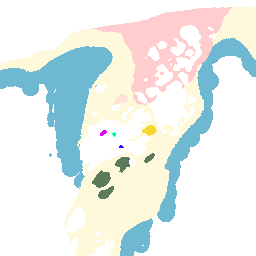

# Mark removed voxels 

1. Download tutorial assets from [teams folder](https://livejohnshopkins.sharepoint.com/:f:/r/sites/3DTBSimulatorUserstudy/Shared%20Documents/General/CodeAssets/ModifyPngsWithHdf5?csf=1&web=1&e=gor1Dx). If access needed please contact jbarrag3@jh.edu.

2. Generate anatomy images. The options --rx, --ry and --rz are used to reduce the original segmented volumes to 256x256 resolution.

```bash
python -m volumetric_sim_tools.Scripts.seg_nrrd_to_pngs -n Segmentation_RT_143.seg.nrrd --dst_p ./Anatomy/ --rx 2 --ry 2 --rz 2
```

3. Generate a new set of anatomical images by removing the voxels that were removed during experiment and stored in a HDF5 file.

```bash
python -m volumetric_sim_tools.Scripts.mark_removed_voxels --png_dir Anatomy/ --hdf5_dir ./2023-02-08_10h-07-14_AnatomyRT143_baseline/ --output_dir ./ModifiedAnatomy
```

If successful the script will generate the following output
```
Loading png images ....
Loading experiment data ...
Number of Files  7
Modify volume ...
correct %: 100.000
Saving volume to png images ....
```

| Original                            | Modified                                 |
| ----------------------------------- | ---------------------------------------- |
|  |  |